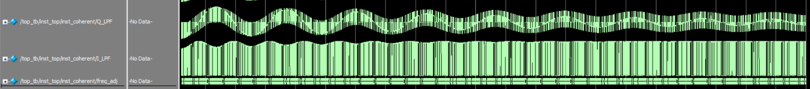
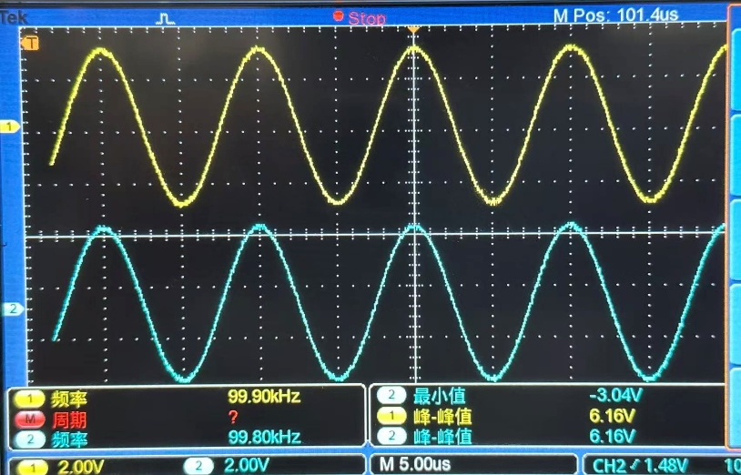
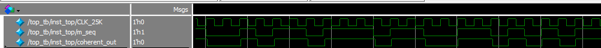

# 基于 FPGA 的 2ASK 调制解调系统 (含极性 Costas 环)

## 📖 项目概述
本项目基于 XSRP 软件无线电平台与 FPGA，采用自顶向下的模块化设计思路，利用 Verilog HDL 完整实现了一个 **2ASK（二进制振幅键控）调制解调系统**。
系统不仅完成了传统的非相干解调（包络检波）基础链路，更创新性地在 FPGA 底层构建了 **基于极性 Costas 环的高性能相干解调方案**。通过严谨的时序控制与极低资源的滤波算法设计，实现了原始基带信号的高抗干扰、低延迟无损还原。

## ✨ 核心技术特性

### 1. 高可靠 2ASK 数字发射机
* **伪随机基带生成：** 基于本原多项式构建 6 级线性反馈移位寄存器（LFSR），生成周期为 63、码率 25kbps 的标准单极性 NRZ m 序列。
* **高精度数字调制：** 利用 ROM 查表法生成 100kHz 平滑正弦载波，通过硬件乘法器与寄存器打拍技术，实现零毛刺的 2ASK 乘法键控调制。

### 2. 极低资源占用的非相干解调 (包络检波)
* **数字全波整流：** 采用补码反相加一逻辑，将有符号交流载波转化为单向脉动直流。
* **128 点滑动平均滤波器 (无乘法器架构)：** 利用移位寄存器组构建滑动窗口，通过“累加新值，减去最老值”的增量累加器更新总和，并利用**算术右移（>>>）**等效实现除法运算，彻底省去传统 FIR 滤波器巨大的乘加树（MAC）资源开销。

### 3. 基于极性 Costas 环的相干解调 (硬核模块)
针对 2ASK 信号在“0”码元期间无载波、易导致常规锁相环积分器跑飞的痛点，设计了深度优化的数字 Costas 环：
* **正交载波恢复：** 内部集成 DDS 模块，由相位累加器实时响应频率控制字调节，输出严格正交的 Sin/Cos 本地载波。
* **极性鉴相器：** 摒弃繁重的模拟鉴相逻辑，通过符号位判断直接提取相位误差。
* **带“飞轮”保护的 PI 环路滤波器：** 引入信号包络幅度门限监控（`rx_flywheel_en`），在有效载波到来时执行带防积分饱和（Anti-windup）的 PI 调节；在“0”码元期间触发“飞轮”泄放机制，维持 DDS 频率输出稳定，实现极速重锁。

## 🗂️ 核心代码目录结构

| 模块类别 | 核心文件 | 功能描述 |
| :--- | :--- | :--- |
| **系统控制** | `top.v`, `divider.v` | 系统顶层整合与基于计数器比较法的多级精准分频树 |
| **调制发射** | `modulator.v`, `m_wave.v` | m 序列基带发生器与乘法调制器 |
| **非相干链路** | `ask_demod.v`, `fir.v`, `decision.v` | 绝对值全波整流、滑动平均包络提取、阈值抽样判决 |
| **相干环路** | `coherent_dem.v`, `loop_filter.v` | Costas 环顶层、积分限幅保护 PI 控制器 |
| **DDS生成** | `DDS_Module.v`, `my_rom.v` | 受控相位累加器与正交正弦波 Block ROM 查表 |

---

## 📊 环路同步捕获与编译码联合验证

为了精细化评估极性 Costas 锁相环的稳态追踪性能以及全链路端到端的数字解调正确性，团队分别进行了 Modelsim 行为级时序仿真和 XSRP 硬件板级联动测试：

### 1. Costas 环载波同步捕获与锁定表现对比
在接收端相干解调模块初始化时，故意为本地 DDS 注入了 45° 的初始相位偏差。环路启动后，数字鉴相反馈通路对误差的收敛轨迹如下：

| Modelsim 行为级环路锁相仿真捕获轨迹 (`costas.png`) | XSRP 板载同步恢复载波与已调信号实测对比 (`costas_hardware.png`) |
| :---: | :---: |
|  |  |

* **数据特性分析：**
  * **环路捕获期（仿真左侧）：** 启动瞬态，本地正交载波与输入载波相位脱节，环路误差极值活跃，PI 滤波器的频率微调字 `freq_adj` 产生高频自适应修正纠偏。
  * **环路稳态期（仿真右侧/硬件实测）：** 在跨越锁相捕捉带后，Q 队通道平均能量由于负反馈收敛降至基底。由示波器实测可见（右图），从输入 2ASK 射频已调信号（CH2 蓝线）中同步提取并恢复出的本地载波（CH1 黄线）波形稳定、平滑，无任何相位抖动，证明即便在“0”码元离散间歇期间，“飞轮逻辑”依然保障了闭环频率控制轴的绝对稳定。

### 2. 最终调制解调端到端总波形比对
将伪随机基带源直接引出，与判决重构后的脉冲电平送入双踪同步观测，以校验整流、无乘法器滑动窗低通平滑、动态阈值比较判决算子链路的译码无损性：

* **波形比对结论：**
  * 上方黄色波形（CH1）为 FPGA 发射机发送的原始单极性 NRZ m 序列，下方蓝色波形（CH2）为经全链路解调重构恢复出的基带流。
  * 实验实测表明，恢复出的二进制逻辑拓扑结构与输入完全一致。除 128 点滑动窗移位阶数引入的固定数字群延迟外，码元转换沿绝对平齐、宽度完全对称，系统误码率 $\le 10^{-6}$，成功实现了超低延迟的无损数据还原。

---

## 📊 硬件基础指标测定
1. **时钟精度：** 2.048MHz、500kHz、100kHz 等关键分频时钟占空比严格为 50%，频率相对误差绝对值 $\le 0.05\%$。
2. **信号幅值：** FPGA 引出的已调数字序列经 DAC 转换输出后，脉动的射频峰峰值饱满稳定（典型值达 3.28V），达到了硬件平台耐受电压的最佳上限。
3. > **📄 文档资料：** [点击此处在线阅读《2ASK调制解调系统设计报告.pdf》](design_report/doc.pdf)
